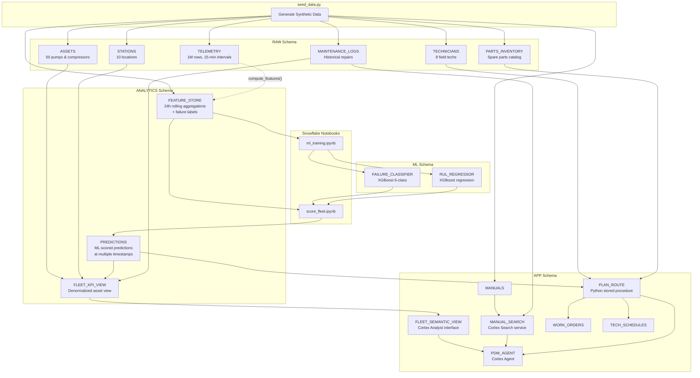

# Predictive Asset Navigator — Architecture

## Overview

A predictive maintenance application for midstream oil & gas pipeline operations in the Permian Basin. The entire application runs natively on Snowflake — the frontend is hosted on Snowpark Container Services (SPCS), ML models are trained and served via Snowflake Notebooks and Model Registry, and an AI assistant is powered by Cortex Agent with three integrated tools.

**50 assets** (pumps + compressors) across **10 stations**, **8 technicians**, **180 days** of telemetry data.

**Live URL**: [https://i7vf4-sfsenorthamerica-jdrew.snowflakecomputing.app](https://i7vf4-sfsenorthamerica-jdrew.snowflakecomputing.app)

---

## System Architecture (SPCS Deployment)

```
                        ┌─────────────────────────────────────────────────┐
                        │          Snowflake Account (SFSENORTHAMERICA-JDREW)        │
                        │                                                             │
 User Browser ──────────┤  ┌───────────────────────────────────────────────────────┐  │
   (HTTPS)              │  │  SPCS: PDM_FRONTEND Service (CPU_X64_XS)              │  │
                        │  │  ┌──────────────────────────────────────────────────┐  │  │
                        │  │  │  Next.js 15 (standalone, Node.js 20, port 3000)  │  │  │
                        │  │  │                                                  │  │  │
                        │  │  │  ┌────────────────┐  ┌────────────────────────┐  │  │  │
                        │  │  │  │ React 19 UI    │  │ API Route Handlers     │  │  │  │
                        │  │  │  │ - MapLibre GL  │  │ /api/assets            │  │  │  │
                        │  │  │  │ - Recharts     │  │ /api/kpis              │  │  │  │
                        │  │  │  │ - TanStack     │  │ /api/predictions       │  │  │  │
                        │  │  │  │ - Tailwind v4  │  │ /api/agent/message     │  │  │  │
                        │  │  │  │ - Dark mode    │  │ /api/dispatch/*        │  │  │  │
                        │  │  │  └────────────────┘  └───────┬────────────────┘  │  │  │
                        │  │  └──────────────────────────────┼───────────────────┘  │  │
                        │  └─────────────────────────────────┼─────────────────────┘  │
                        │                                    │                        │
                        │         ┌──────────────────────────┼─────────────────┐      │
                        │         │  snowflake-sdk (Key-Pair JWT)              │      │
                        │         │  fetch() REST API (PAT Bearer token)       │      │
                        │         └──────────────────────────┼─────────────────┘      │
                        │                                    │                        │
                        │  ┌──────────────┐  ┌──────────────┴┐  ┌───────────────┐    │
                        │  │ Cortex Agent │  │ Cortex Analyst │  │ Cortex Search │    │
                        │  │ PDM_AGENT    │  │ Semantic View  │  │ MANUAL_SEARCH │    │
                        │  │ claude-4-    │  │ FLEET_         │  │ arctic-embed  │    │
                        │  │ sonnet       │  │ SEMANTIC_VIEW  │  │               │    │
                        │  └──────┬───────┘  └───────────────┘  └───────────────┘    │
                        │         │                                                   │
                        │  ┌──────┴───────┐  ┌───────────────┐  ┌───────────────┐    │
                        │  │ PLAN_ROUTE   │  │ ML Registry   │  │ Feature Store │    │
                        │  │ Python SP    │  │ FAILURE_CLF   │  │ 49K rows      │    │
                        │  │ Haversine    │  │ RUL_REG v2    │  │ 29 features   │    │
                        │  └──────────────┘  └───────────────┘  └───────────────┘    │
                        └─────────────────────────────────────────────────────────────┘
```

---

## Authentication Architecture

The SPCS container uses **two separate auth methods** for different operations:

```
┌─────────────────────────────────────────────────────────────┐
│  SPCS Container (PDM_FRONTEND)                               │
│                                                              │
│  ┌─────────────────────────────┐                             │
│  │ SQL Queries (snowflake-sdk) │                             │
│  │ authenticator: SNOWFLAKE_JWT│──► Key-Pair JWT             │
│  │ privateKey: from secret     │   (SNOWFLAKE_PRIVATE_KEY)   │
│  └─────────────────────────────┘                             │
│                                                              │
│  ┌─────────────────────────────┐                             │
│  │ REST API calls (fetch)      │                             │
│  │ Cortex Agent, Cortex Analyst│──► PAT Bearer Token         │
│  │ Authorization: Bearer <pat> │   (SNOWFLAKE_PAT)           │
│  │ + X-Snowflake-Authorization │                             │
│  │   -Token-Type: PAT          │                             │
│  └─────────────────────────────┘                             │
└──────────────────────────────────────────────────────────────┘
```

### Authentication Matrix

| Operation | Auth Method | Header Format | Secret Source |
|-----------|-------------|---------------|---------------|
| SQL queries (snowflake-sdk) | Key-Pair JWT | `authenticator: SNOWFLAKE_JWT` + `privateKey` | `SNOWFLAKE_PRIVATE_KEY_SECRET` |
| Cortex Agent REST API | PAT | `Authorization: Bearer <pat>` + `X-Snowflake-Authorization-Token-Type: PROGRAMMATIC_ACCESS_TOKEN` | `SNOWFLAKE_PAT_SECRET` |
| Cortex Analyst REST API | PAT | Same as above | Same |

### What Does NOT Work

| Method | Issue |
|--------|-------|
| SPCS OAuth (`/snowflake/session/token`) for Cortex Agent | Returns 401 error 390104 |
| PAT with `Snowflake Token="..."` format | Returns 401 — wrong header format for PAT |
| SPCS OAuth for SQL on this account | Blocked by account network policy |

---

## Network & Security Layer

```
┌─────────────────────────────────────────────────────────────────┐
│  PDM_FRONTEND Service                                            │
│  networkPolicyConfig.allowInternetEgress: true                   │
│                                                                  │
│  External Access Integrations:                                   │
│  ├── PDM_DEMO_EXTERNAL_ACCESS                                    │
│  │   └── Network Rule: OSM_TILES_RULE                            │
│  │       └── EGRESS → tile.openstreetmap.org:443 (map tiles)     │
│  │                                                               │
│  └── PDM_CORTEX_EXTERNAL_ACCESS                                  │
│      ├── Network Rule: SNOWFLAKE_API_RULE                        │
│      │   └── EGRESS → sfsenorthamerica-jdrew.snowflakecomputing  │
│      │                 .com:443 (Cortex Agent REST API)           │
│      └── Auth Secret: SNOWFLAKE_PAT_SECRET (for Bearer token)    │
│                                                                  │
│  Mounted Secrets (env vars):                                     │
│  ├── SNOWFLAKE_PRIVATE_KEY_SECRET → SNOWFLAKE_PRIVATE_KEY        │
│  └── SNOWFLAKE_PAT_SECRET → SNOWFLAKE_PAT                        │
└─────────────────────────────────────────────────────────────────┘
```

Both `allowInternetEgress: true` AND `EXTERNAL_ACCESS_INTEGRATIONS` are required. The former enables general internet access; the latter authorizes specific endpoints and secrets.

After every `ALTER SERVICE`, external access integrations must be re-applied:
```sql
ALTER SERVICE PDM_DEMO.APP.PDM_FRONTEND
  SET EXTERNAL_ACCESS_INTEGRATIONS = (PDM_CORTEX_EXTERNAL_ACCESS, PDM_DEMO_EXTERNAL_ACCESS);
```

---

## Setup Sequence

Run these steps in order to deploy the demo:

```
1. snowflake/setup.sql          → Creates database, schemas, tables, views, stages
2. snowflake/seed_data.py       → Generates synthetic data into RAW + ANALYTICS schemas
3. notebooks/ml_training.ipynb  → Trains ML models, registers to ML schema (run in Snowsight)
4. notebooks/score_fleet.ipynb  → Scores fleet with models, writes PREDICTIONS (run in Snowsight)
5. snowflake/cortex_services.sql → Creates Cortex Search + Semantic View
6. snowflake/route_planner_sp.sql → Creates PLAN_ROUTE stored procedure
7. snowflake/cortex_agent.sql   → Creates PDM_AGENT with 3 tools
8. Create secrets, network rules, external access integrations (see SPCS Deployment below)
9. Build Docker image, push to SPCS registry, create/alter service
```

---

## Proving It's Real — Technical Walkthrough Artifacts

The demo includes SQL worksheets and notebooks to prove every component is real (not hardcoded):

### SQL Proof Worksheets (`snowflake/proof/`)

| Worksheet | What It Proves |
|-----------|---------------|
| `01_explore_raw_data.sql` | 10 stations, 50 assets, 931K+ telemetry rows, 499 maintenance events, 8 PDF manuals on stage |
| `02_ml_pipeline_proof.sql` | Feature Store (31 engineered features), Model Registry (versions + metrics), predictions correlate with sensor degradation |
| `03_cortex_services_proof.sql` | Live Cortex Search over real PDFs, Semantic View, Agent with 3 tools, route planner SP |
| `04_live_predictions.sql` | RUL counting down day-by-day, risk escalation, different failure modes for different equipment |

### ML Training Notebook (`notebooks/ml_training.ipynb`)

16 cells with section headers for demo walkthrough:
1. Required Packages + Pipeline Overview
2. Load Feature Store (real data from `ANALYTICS.FEATURE_STORE`)
3. Engineer 31 Features (z-score severity, interaction terms, degradation intensity)
4. SMOTE Oversampling (balances minority failure classes)
5. Train XGBoost Classifier (multi-class failure mode, prints F1/accuracy)
6. Train XGBoost Regressor (RUL prediction, prints MAE/R²)
7. Register to ML Registry (versioned models with metrics)
8. Verify Registered Models

### Equipment Manuals (8 Real PDFs on Stage)

| PDF | Equipment Type |
|-----|---------------|
| `Ariel_JGK-4_manual.pdf` | Compressor |
| `Atlas_Copco_GA-90_manual.pdf` | Compressor |
| `Dresser-Rand_DATUM_manual.pdf` | Compressor |
| `Ingersoll_Rand_Centac_manual.pdf` | Compressor |
| `Flowserve_HPRT_manual.pdf` | Pump |
| `Grundfos_CRN_manual.pdf` | Pump |
| `Sulzer_MSD_manual.pdf` | Pump |
| `Sundyne_LMV-311_manual.pdf` | Pump |

### Demo Walkthrough Order

1. **Raw Data** — Run `snowflake/proof/01_explore_raw_data.sql` to show the foundation
2. **ML Training** — Open `notebooks/ml_training.ipynb` in Snowsight, walk through each step
3. **Model Proof** — Run `snowflake/proof/02_ml_pipeline_proof.sql` to show models are real
4. **AI Stack** — Run `snowflake/proof/03_cortex_services_proof.sql` to show Search, Analyst, Agent
5. **Live Predictions** — Run `snowflake/proof/04_live_predictions.sql` to show predictions changing over time
6. **The App** — Open the dashboard to show what all of this powers

---

## Data Flow



---

## ML Pipeline

### Training Flow

```
ANALYTICS.FEATURE_STORE (45K rows)
    │
    │  Contains:
    │  - 24h rolling sensor aggregations (mean, std, max, trend)
    │  - Engineered features (VIB_TEMP_INTERACTION, POWER_EFFICIENCY, etc.)
    │  - Labels: FAILURE_LABEL, DAYS_TO_FAILURE (from synthetic generation)
    │
    ▼
ml_training.ipynb (Snowflake Notebook, PDM_DEMO.ML.ML_TRAINING)
    │
    ├── Load data from FEATURE_STORE
    ├── Feature engineering (32 features total)
    ├── Minority oversampling for class imbalance (~98% NORMAL)
    ├── XGBoost training with StratifiedKFold CV
    ├── LogisticRegression calibrator for severity-scaled probabilities
    │
    ▼
ML.FAILURE_CLASSIFIER (v7)   ML.RUL_REGRESSOR (v7)   ML.PROBABILITY_CALIBRATOR (v7)
    │                              │                         │
    └──────────────────────────────┴─────────────────────────┘
                                   │
                                   ▼
                           Snowflake Model Registry (PDM_DEMO.ML)
                           + MODEL_METADATA table (baselines + version)
```

### Model Details

| Model | Version | Framework | Task | Purpose |
|-------|---------|-----------|------|---------|
| FAILURE_CLASSIFIER | v7 | XGBClassifier | 6-class classification | Predicts failure mode |
| RUL_REGRESSOR | v7 | XGBRegressor | Regression | Predicts Remaining Useful Life (days) |
| PROBABILITY_CALIBRATOR | v7 | LogisticRegression | Probability scaling | Severity-scaled class probabilities |

### Why Three Models?

1. **FAILURE_CLASSIFIER (XGBoost)** — Predicts failure mode (BEARING_WEAR, VALVE_FAILURE, etc.)
   - Produces crisp classifications via gradient boosting
   - `predict_proba()` tends to be overconfident for early degradation stages

2. **PROBABILITY_CALIBRATOR (LogisticRegression)** — Produces severity-scaled probabilities
   - Same input features as classifier, but returns smoother probability distributions
   - Probabilities increase gradually as sensor readings deviate from NORMAL baselines
   - Essential for the app's probability progression charts over time

3. **RUL_REGRESSOR (XGBoost)** — Predicts Remaining Useful Life in days
   - Trained only on non-NORMAL samples (assets with active degradation)
   - NORMAL assets receive null RUL (infinite remaining life)

### Scoring Flow

```
ANALYTICS.FEATURE_STORE
    │
    │  Filter to demo date range (2026-03-06 to 2026-03-20)
    │
    ▼
ML.SCORE_FLEET_SP (Stored Procedure) or score_fleet.py
    │
    ├── Load models from Snowflake ML Registry:
    │   - clf = registry.get_model('FAILURE_CLASSIFIER').version(model_version).load()
    │   - reg = registry.get_model('RUL_REGRESSOR').version(model_version).load()
    │   - prob_model = registry.get_model('PROBABILITY_CALIBRATOR').version(model_version).load()
    │
    ├── Load baselines from MODEL_METADATA table:
    │   - vib_mean, vib_std, temp_mean, temp_std, classes
    │
    ├── Engineer same features as training (32 features):
    │   - VIB_SEVERITY = (vibration - vib_mean) / vib_std
    │   - TEMP_SEVERITY = (temperature - temp_mean) / temp_std
    │   - DEGRADATION_INTENSITY = sqrt(clipped severity scores)
    │
    ├── Run inference:
    │   - cls_preds = clf.predict(X)           → failure class index
    │   - rul_preds = reg.predict(X)           → RUL in days
    │   - cls_probas = prob_model.predict_proba(X) → class probabilities
    │
    ├── Derive RISK_LEVEL:
    │   - OFFLINE: RUL <= 2 days
    │   - CRITICAL: RUL <= 7 days
    │   - WARNING: RUL <= 30 days
    │   - HEALTHY: RUL > 30 days or NORMAL class
    │
    ▼
ANALYTICS.PREDICTIONS (11K+ rows)
    │
    │  One row per asset per timestamp
    │  Columns: ASSET_ID, AS_OF_TS, PREDICTED_CLASS, 
    │           CLASS_PROBABILITIES (JSON), PREDICTED_RUL_DAYS, RISK_LEVEL,
    │           MODEL_VERSION, SCORED_AT
    │
    │  Example CLASS_PROBABILITIES:
    │  {"BEARING_WEAR": 0.827, "NORMAL": 0.1494, "OVERHEATING": 0.0,
    │   "SEAL_LEAK": 0.0237, "SURGE": 0.0, "VALVE_FAILURE": 0.0}
    │
    ▼
ANALYTICS.FLEET_KPI_VIEW
    │
    │  Joins: ASSETS + STATIONS + latest PREDICTIONS + MAINTENANCE summary
    │  Always returns latest prediction per asset
    │
    ▼
APP.FLEET_SEMANTIC_VIEW
    │
    │  Cortex Analyst interface for natural language queries
    │
    ▼
Application + PDM_AGENT
```

### Inference Code Path (Verified)

**Scoring Stored Procedure** (`snowflake/score_fleet_sp.sql`):
```python
from snowflake.ml.registry import Registry

registry = Registry(session=session, database_name='PDM_DEMO', schema_name='ML')
clf = registry.get_model('FAILURE_CLASSIFIER').version(model_version).load(force=True)
reg = registry.get_model('RUL_REGRESSOR').version(model_version).load(force=True)
prob_model = registry.get_model('PROBABILITY_CALIBRATOR').version(model_version).load(force=True)

X_score = pdf[FEATURE_COLS].values
cls_preds = clf.predict(X_score)           # XGBoost classifier
rul_preds = reg.predict(X_score)           # XGBoost regressor
cls_probas = prob_model.predict_proba(X_score)  # LogisticRegression calibrator
```

**Key Point:** All classifications, probabilities, and RUL values come from **actual trained ML models** loaded from the Snowflake ML Registry—not rule-based logic.

### 32 Input Features

| Category | Features |
|----------|----------|
| Vibration | VIBRATION_MEAN_24H, VIBRATION_STD_24H, VIBRATION_MAX_24H, VIBRATION_TREND |
| Temperature | TEMPERATURE_MEAN_24H, TEMPERATURE_STD_24H, TEMPERATURE_MAX_24H, TEMPERATURE_TREND |
| Pressure | PRESSURE_MEAN_24H, PRESSURE_STD_24H, DIFF_PRESSURE_MEAN_24H |
| Flow & Power | FLOW_RATE_MEAN_24H, RPM_MEAN_24H, RPM_STD_24H, POWER_DRAW_MEAN_24H |
| Compressor-specific | DISCHARGE_TEMP_MEAN_24H, COMPRESSION_RATIO_MEAN, OIL_PRESSURE_MEAN_24H |
| Pump-specific | SEAL_TEMP_MEAN_24H |
| Maintenance | DAYS_SINCE_MAINTENANCE, MAINTENANCE_COUNT_90D, OPERATING_HOURS |
| Asset Type | IS_PUMP (binary) |
| Engineered | VIB_TEMP_INTERACTION, POWER_EFFICIENCY, PRESSURE_VARIABILITY |
| Deviations | VIB_DEVIATION, TEMP_DEVIATION, MAINT_RECENCY_SCORE |
| Severity Z-scores | VIB_SEVERITY, TEMP_SEVERITY, DEGRADATION_INTENSITY |

**Severity features** use NORMAL baselines stored in MODEL_METADATA:
```
VIB_SEVERITY = (VIBRATION_MEAN_24H - 3.4679) / 0.8777
TEMP_SEVERITY = (TEMPERATURE_MEAN_24H - 180.7056) / 11.7088
DEGRADATION_INTENSITY = sqrt(clamp(VIB_SEVERITY,0)² + clamp(TEMP_SEVERITY,0)²)
```

### Failure Classes

| Class | Description | Key Sensors |
|-------|-------------|-------------|
| NORMAL | Healthy operation | All within bounds |
| BEARING_WEAR | Bearing degradation | vibration, temperature, RPM, oil_pressure |
| VALVE_FAILURE | Valve malfunction | pressure, flow_rate, differential_pressure |
| SEAL_LEAK | Seal degradation (pumps) | pressure, seal_temperature, suction_pressure |
| SURGE | Compressor surge | flow_rate, pressure, compression_ratio, RPM |
| OVERHEATING | Thermal stress | temperature, discharge_temp, power_draw |

### Risk Levels

| Level | RUL Range | Color |
|-------|-----------|-------|
| CRITICAL | <= 7 days | Red |
| WARNING | 8-30 days | Amber |
| HEALTHY | > 30 days | Green |
| OFFLINE | RUL = 0 | Gray |

---

## Cortex Agent Architecture

```
                     User Question
                          │
                          ▼
                 ┌─────────────────┐
                 │   PDM_AGENT     │
                 │ (claude-4-sonnet)│
                 └────┬───┬───┬────┘
                      │   │   │
         ┌────────────┘   │   └────────────┐
         ▼                ▼                ▼
   ┌───────────┐   ┌───────────┐   ┌──────────────┐
   │ fleet_    │   │ manual_   │   │ plan_route   │
   │ analyst   │   │ search    │   │              │
   │           │   │           │   │              │
   │ Cortex    │   │ Cortex    │   │ PLAN_ROUTE   │
   │ Analyst   │   │ Search    │   │ Python SP    │
   │           │   │           │   │              │
   │ Text->SQL │   │ RAG over  │   │ Haversine    │
   │ via       │   │ manuals + │   │ routing,     │
   │ Semantic  │   │ maint     │   │ severity     │
   │ View      │   │ logs      │   │ bundling     │
   └───────────┘   └───────────┘   └──────────────┘
         │                │                │
         ▼                ▼                ▼
   FLEET_KPI_VIEW   APP.MANUALS      PREDICTIONS
                    MAINTENANCE_LOGS  TECHNICIANS
                                      PARTS_INVENTORY
```

### Agent Tools

| Tool | Type | Purpose | Data Source |
|------|------|---------|-------------|
| fleet_analyst | cortex_analyst_text_to_sql | Quantitative queries (counts, averages, comparisons) | FLEET_SEMANTIC_VIEW -> FLEET_KPI_VIEW |
| manual_search | cortex_search | Procedures, troubleshooting, safety info | MANUALS (71 docs, arctic-embed-m-v1.5) |
| plan_route | generic (procedure) | Intelligent route optimization with co-maintenance bundling | PLAN_ROUTE SP -> PREDICTIONS, TECHNICIANS, PARTS_INVENTORY |

### Agent Instructions Include

- Failure-mode -> sensor mapping (which sensors drive each failure class)
- Co-replacement intelligence (which parts wear together)
- Model-specific diagnosis guidance for all 8 equipment models
- Structured response format: signals -> manual excerpts -> action list -> safety cautions

### Cortex Assistant UI Integration

The ChatPanel component provides a floating assistant available on asset detail and dispatch pages.

**SSE Stream Parsing:** The assistant uses Server-Sent Events (SSE) for streaming responses. Critical implementation details:
- Uses buffer-based parsing to handle chunk boundaries (SSE data can split across chunks)
- Parses multiple event types: `response.text.delta` (incremental text), `response.text` (complete text), `response` (full response with tool use)
- Tool use events (`response.tool_use`, `response.tool_result.status`) are tracked for UI display

**Context-Aware Prompts:**
| Trigger | Prompt Template | Purpose |
|---------|-----------------|---------|
| Asset Explain button (from map) | "Diagnose asset X. Query telemetry data and explain which sensor readings indicate this failure mode. Do NOT recommend a technician." | Diagnosis only, no dispatch |
| Route Explain button (dispatch page) | "Explain the reasoning behind this maintenance route plan: [stops + co-maintenance items]. Why were these specific co-maintenance tasks recommended?" | Route + co-maint justification |

---

## Intelligent Route Planner (PLAN_ROUTE)

The route planner doesn't just sequence stops — it actively looks for efficiency opportunities:

### Core Intelligence

1. **Geographic Optimization**: Nearest-neighbor routing from technician's home base
2. **Severity Prioritization**: FAILED → CRITICAL → WARNING ordering
3. **Schedule Awareness**: Respects existing commitments, blocked dates (PTO, training)
4. **Certification Matching**: Warns if tech lacks required certs
5. **Co-Maintenance Bundling**: ALWAYS scans same-site healthy assets for preventive work

### How It Works

```
Primary Asset (Critical/Warning/Healthy)
    │
    ▼
PLAN_ROUTE SP builds route:
    │
    ├── 1. Start from tech's home base
    ├── 2. Add primary asset as first stop
    ├── 3. Find other at-risk assets, sort by severity + proximity
    ├── 4. At EACH visited station:
    │       └── Scan ALL co-located HEALTHY assets for:
    │           • Rising sensor trends (vibration, temp)
    │           • Overdue preventive maintenance (>45 days)
    │           • Approaching PM interval (>25 days)
    │           • High operating hours (>100K)
    │           • Elevated sensor thresholds
    ├── 5. Bundle co-maintenance if time permits (35% budget)
    └── 6. Generate reasoning for EVERY decision
    │
    ▼
Route with stops, parts, co-maintenance, and explanations
```

### Co-Maintenance Triggers

| Trigger | Condition | Task Generated |
|---------|-----------|----------------|
| `sensor_trend` | Vibration trend > 0.001/hr | "Vibration trending up — inspect bearings" |
| `sensor_threshold` | Vibration > 4.0 mm/s | "Elevated vibration — check mounting" |
| `maintenance_overdue` | Days since service > 45 | "Overdue PM — full service required" |
| `maintenance_due_soon` | Days since service > 25 | "PM due soon — lubrication check" |
| `operating_hours` | Hours > 100,000 | "High-hour inspection — wear assessment" |
| `routine` | None of above | "Visual inspection while on-site" |

Each co-maintenance task includes a `reasoning` field explaining why it was added.

### Route Response Data Structure

Each `RouteStop` in the route response includes:
```typescript
interface RouteStop {
  // ... primary asset fields ...
  co_maintenance: CoMaintenance[];  // Co-maint tasks for this stop
  co_maintenance_hours?: number;    // Total hours for co-maint tasks
  stop_total_hours?: number;        // Primary repair + co-maint hours
}

interface CoMaintenance {
  asset_id: number;      // Nearby asset to inspect
  asset_type: string;    // PUMP or COMPRESSOR
  task: string;          // e.g., "Thermal Inspection", "Vibration Check"
  estimated_hours: number;
}
```

### Example Route Output

```json
{
  "route": [
    {
      "stop_number": 1,
      "asset_id": 1,
      "station": "Midland Junction",
      "predicted_class": "BEARING_WEAR",
      "rul_days": 12.3,
      "risk_level": "WARNING",
      "estimated_repair_hours": 4.0,
      "reasoning": "Asset 1 (Flowserve HPRT) shows BEARING_WEAR failure pattern driven by vibration. Estimated 12.3 days until failure.",
      "co_maintenance": [
        {
          "asset_id": 2,
          "task": "PM due soon — Grundfos CRN at 28d, lubrication & filter check",
          "estimated_hours": 0.75,
          "trigger": "maintenance_due_soon",
          "reasoning": "Approaching 30-day maintenance interval. Performing service now while on-site saves a dedicated trip."
        },
        {
          "asset_id": 3,
          "task": "Vibration trending up — Sulzer MSD at +0.0023/hr, inspect bearings",
          "estimated_hours": 1.25,
          "trigger": "sensor_trend",
          "reasoning": "Vibration increasing at 0.0023/hr indicates developing bearing wear. Early intervention prevents catastrophic failure."
        }
      ],
      "co_maintenance_hours": 2.0,
      "stop_total_hours": 6.0
    }
  ],
  "route_explanation": "**Primary target:** Asset 1 (Flowserve HPRT) at Midland Junction — BEARING_WEAR failure pattern detected, 12.3d RUL, WARNING priority.\n\n**Preventive bundling:** 2 co-maintenance task(s) on healthy equipment at visited stations (1 maintenance due soon, 1 sensor trend). This maximizes technician utilization and prevents future trips.",
  "routing_decisions": [
    {"asset_id": 1, "decision": "primary_stop", "reasoning": "..."},
    {"asset_id": 2, "decision": "co_maintenance", "reasoning": "..."},
    {"asset_id": 3, "decision": "co_maintenance", "reasoning": "..."}
  ],
  "day_summary": [{"day": 1, "utilization_pct": 96.3}]
}
```

### Route Summary Fields

| Field | Description |
|-------|-------------|
| `route_explanation` | Markdown narrative explaining the routing logic |
| `routing_decisions` | Array of decisions with reasoning for each asset |
| `co_maintenance_count` | Total co-maintenance tasks across all stops |
| `day_summary` | Per-day hours breakdown and utilization % |

---

## Complete Snowflake Object Inventory

### Database: PDM_DEMO

#### RAW Schema (Source Data)

| Table | Rows | Purpose |
|-------|------|---------|
| STATIONS | 10 | Permian Basin station locations with lat/lon |
| ASSETS | 50 | Pumps and compressors with model/manufacturer |
| TELEMETRY | 1,032,000 | 180 days x 50 assets x 15-min intervals, 14 sensor columns |
| MAINTENANCE_LOGS | 499 | Historical maintenance events with parts, cost, duration |
| PARTS_INVENTORY | 50 | Parts catalog by asset type and category |
| TECHNICIANS | 8 | Field techs with home base, certifications, availability |

#### ANALYTICS Schema (ML Pipeline)

| Object | Type | Rows | Purpose |
|--------|------|------|---------|
| FEATURE_STORE | Table | 45,360 | 24h rolling aggregations + labels for ML training |
| PREDICTIONS | Table | 11,250 | ML-scored predictions at multiple timestamps |
| FLEET_KPI_VIEW | View | 50 | Denormalized: assets + stations + latest predictions + maintenance |

#### ML Schema (Models + Notebooks)

| Object | Type | Versions | Purpose |
|--------|------|----------|---------|
| FAILURE_CLASSIFIER | Model | v7 (current) | XGBoost 6-class failure classification |
| RUL_REGRESSOR | Model | v7 (current) | XGBoost RUL regression (trained on non-NORMAL samples) |
| PROBABILITY_CALIBRATOR | Model | v7 (current) | LogisticRegression for severity-scaled class probabilities |
| MODEL_METADATA | Table | - | Stores baselines (vib_mean, temp_mean, classes) and MODEL_VERSION |
| SCORE_FLEET_SP | Stored Procedure | - | Python SP to load models from registry and score fleet |
| ML_TRAINING | Notebook | - | Full ML training pipeline |
| SCORE_FLEET | Notebook | - | Interactive fleet scoring |

#### APP Schema (Application + AI Services)

| Object | Type | Purpose |
|--------|------|---------|
| MANUALS | Table (71 rows) | Equipment manual sections from PARSE_DOCUMENT |
| WORK_ORDERS | Table | Dispatch work orders with tech assignment |
| TECH_SCHEDULES | Table | Technician schedule blocks |
| FLEET_SEMANTIC_VIEW | Semantic View | Cortex Analyst text-to-SQL interface |
| MANUAL_SEARCH | Cortex Search Service | RAG over manuals (71 docs, arctic-embed-m-v1.5) |
| PDM_AGENT | Cortex Agent | AI assistant with 3 tools (claude-4-sonnet) |
| PLAN_ROUTE | Stored Procedure | Python SP for route optimization (Haversine distance) |
| DATA_STAGE | Stage (internal) | Application data files |
| MODELS | Stage (internal) | Semantic model YAML |
| SPECS | Stage (internal) | Service specifications |
| PDM_REPO | Image Repository | Docker images for SPCS |
| SNOWFLAKE_PAT_SECRET | Secret (GENERIC_STRING) | PAT token for REST API auth |
| SNOWFLAKE_PRIVATE_KEY_SECRET | Secret (GENERIC_STRING) | RSA private key for SQL auth |
| OSM_TILES_RULE | Network Rule (EGRESS) | tile.openstreetmap.org:443 |
| SNOWFLAKE_API_RULE | Network Rule (EGRESS) | sfsenorthamerica-jdrew.snowflakecomputing.com:443 |

#### Account-Level Objects

| Object | Type | Purpose |
|--------|------|---------|
| PDM_DEMO_POOL | Compute Pool (CPU_X64_XS) | Hosts the SPCS service (1 node) |
| PDM_DEMO_WH | Warehouse (Medium) | Query execution, ML scoring |
| PDM_DEMO_EXTERNAL_ACCESS | External Access Integration | Map tile egress (OSM_TILES_RULE) |
| PDM_CORTEX_EXTERNAL_ACCESS | External Access Integration | Cortex REST API egress (SNOWFLAKE_API_RULE + PAT secret) |
| PDM_FRONTEND | Service (SPCS) | Next.js app, public endpoint at *.snowflakecomputing.app |

---

## SPCS Deployment Details

### Service Specification

```yaml
spec:
  containers:
    - name: frontend
      image: /pdm_demo/app/pdm_repo/frontend:v24
      env:
        SNOWFLAKE_HOST: sfsenorthamerica-jdrew.snowflakecomputing.com
        SNOWFLAKE_ACCOUNT: SFSENORTHAMERICA-JDREW
        SNOWFLAKE_USER: ADMIN
        SNOWFLAKE_WAREHOUSE: PDM_DEMO_WH
        SNOWFLAKE_DATABASE: PDM_DEMO
        SNOWFLAKE_SCHEMA: APP
      secrets:
        - snowflakeSecret:
            objectName: PDM_DEMO.APP.SNOWFLAKE_PRIVATE_KEY_SECRET
          secretKeyRef: secret_string
          envVarName: SNOWFLAKE_PRIVATE_KEY
        - snowflakeSecret:
            objectName: PDM_DEMO.APP.SNOWFLAKE_PAT_SECRET
          secretKeyRef: secret_string
          envVarName: SNOWFLAKE_PAT
      readinessProbe:
        port: 3000
        path: /api/health
      resources:
        requests: { memory: 1G, cpu: 0.5 }
        limits: { memory: 2G, cpu: 1 }
  endpoints:
    - name: ui
      port: 3000
      public: true
  networkPolicyConfig:
    allowInternetEgress: true
```

### Docker Image

```dockerfile
FROM node:20-alpine AS builder
WORKDIR /app
COPY package*.json ./
RUN npm ci
COPY . .
RUN npm run build

FROM node:20-alpine AS runner
WORKDIR /app
ENV NODE_ENV=production PORT=3000 HOSTNAME="0.0.0.0"
RUN addgroup --system --gid 1001 nodejs && adduser --system --uid 1001 nextjs
COPY --from=builder /app/public ./public
COPY --from=builder --chown=nextjs:nodejs /app/.next/standalone ./
COPY --from=builder --chown=nextjs:nodejs /app/.next/static ./.next/static
USER nextjs
EXPOSE 3000
CMD ["node", "server.js"]
```

Build: `docker buildx build --platform linux/amd64 -t frontend:v24 .` (MUST use `--platform linux/amd64` for SPCS)

### Update Workflow

```bash
# 1. Build with new version tag (never reuse tags — SPCS caches images)
docker buildx build --platform linux/amd64 -t sfsenorthamerica-jdrew.registry.snowflakecomputing.com/pdm_demo/app/pdm_repo/frontend:vN .

# 2. Login to SPCS registry (token expires — re-run before each push session)
snow spcs image-registry login --connection jdrew

# 3. Push
docker push sfsenorthamerica-jdrew.registry.snowflakecomputing.com/pdm_demo/app/pdm_repo/frontend:vN

# 3. ALTER SERVICE (preserves URL — never DROP/CREATE)
snow sql --connection jdrew -q "ALTER SERVICE PDM_DEMO.APP.PDM_FRONTEND FROM SPECIFICATION \$\$$(cat pdm_service.yaml)\$\$"

# 4. Re-apply external access integrations (stripped by ALTER SERVICE)
snow sql --connection jdrew -q "ALTER SERVICE PDM_DEMO.APP.PDM_FRONTEND SET EXTERNAL_ACCESS_INTEGRATIONS = (PDM_CORTEX_EXTERNAL_ACCESS, PDM_DEMO_EXTERNAL_ACCESS)"

# 5. Wait for READY
snow sql --connection jdrew -q "SELECT SYSTEM\$GET_SERVICE_STATUS('PDM_DEMO.APP.PDM_FRONTEND')"
```

---

## Time Travel Simulation

The demo supports "time travel" to show how predictions change over time.

| Label | Timestamp | Description |
|-------|-----------|-------------|
| Now | 2026-03-13 12:00 | Baseline demo date |
| +24h | 2026-03-14 12:00 | One day forward |
| +72h | 2026-03-16 12:00 | Three days forward |
| +7d | 2026-03-20 12:00 | One week forward |

**How it works:**
1. PREDICTIONS table contains rows for each asset at multiple AS_OF_TS values
2. Frontend passes `as_of_ts` query parameter to API routes
3. API queries filter: `WHERE AS_OF_TS <= ? QUALIFY ROW_NUMBER() OVER (PARTITION BY ASSET_ID ORDER BY AS_OF_TS DESC) = 1`
4. This returns the most recent prediction for each asset as of that timestamp

**Degrading assets** show progression from HEALTHY -> WARNING -> CRITICAL -> OFFLINE as time advances.

---

## Frontend Architecture

### Stack
- **Next.js 15** (App Router, React 19, standalone output)
- **MapLibre GL JS** — fleet map with station clusters and asset drill-down
- **Recharts** — sensor trend charts, probability bars, maintenance history
- **TanStack React Query** — server state management
- **Tailwind CSS v4** — styling with dark mode support
- **Lucide React** — icons
- **snowflake-sdk** — server-side Snowflake connector (Key-Pair JWT auth)

### Pages

| Route | Purpose |
|-------|---------|
| `/` | Dashboard: KPI cards + fleet map + alert panel |
| `/asset/[id]` | Asset detail: Overview, Trends, Maintenance tabs + Cortex Assistant |
| `/dispatch` | Tech selection, route planning, work order bundling |

### Provider Hierarchy

```jsx
<QueryProvider>
  <TimeTravelProvider>
    <ThemeProvider>
      <ChatProvider>
        {children}
        <ChatPanel />   // floating, available on asset detail pages
      </ChatProvider>
    </ThemeProvider>
  </TimeTravelProvider>
</QueryProvider>
```

### API Routes

| Endpoint | Method | Purpose | Auth |
|----------|--------|---------|------|
| `/api/assets` | GET | All assets with latest predictions | SQL (Key-Pair) |
| `/api/assets/[id]` | GET | Single asset detail | SQL |
| `/api/assets/[id]/telemetry` | GET | Sensor telemetry time series | SQL |
| `/api/kpis` | GET | Fleet KPI summary | SQL |
| `/api/predictions` | GET | All predictions | SQL |
| `/api/predictions/[id]` | GET | Prediction history for one asset | SQL |
| `/api/maintenance/[id]` | GET | Maintenance logs for one asset | SQL |
| `/api/technicians` | GET | All technicians | SQL |
| `/api/technicians/[techId]` | GET | Single technician detail | SQL |
| `/api/tech-schedules` | GET | Technician schedules | SQL |
| `/api/tech-availability` | GET | Tech availability windows | SQL |
| `/api/stations` | GET | Station locations | SQL |
| `/api/work-orders` | GET | Work orders | SQL |
| `/api/dispatch/plan-route` | POST | Calls PLAN_ROUTE SP (includes co-maintenance recommendations) | SQL |
| `/api/dispatch/suggest-tech` | POST | Ranks techs by distance/certs/availability | SQL |
| `/api/dispatch/bundle-wo` | POST | Batch-create work orders | SQL |
| `/api/dispatch/reset-demo` | POST | Calls RESET_DEMO SP | SQL |
| `/api/dispatch/co-maintenance` | POST | Get co-maintenance recommendations for assets | SQL |
| `/api/agent/thread` | POST | Create local chat thread (UUID) | None |
| `/api/agent/message` | POST | Send message to Cortex Agent (SSE streaming) | REST (PAT) |
| `/api/health` | GET | Readiness probe | None |

All data endpoints accept optional `?as_of_ts=` parameter for time travel.

---

## Snowflake Capabilities Demonstrated

| Capability | Object(s) | Usage |
|------------|-----------|-------|
| **Snowpark Container Services** | PDM_FRONTEND, PDM_DEMO_POOL, PDM_REPO | Full-stack web app hosting |
| **Cortex Agent** | PDM_AGENT | Multi-tool AI orchestration (claude-4-sonnet) |
| **Cortex Analyst** | FLEET_SEMANTIC_VIEW | Natural language -> SQL over fleet data |
| **Cortex Search** | MANUAL_SEARCH | RAG over equipment manuals + maintenance logs |
| **ML Model Registry** | FAILURE_CLASSIFIER, RUL_REGRESSOR | Model versioning, batch inference |
| **Snowflake Notebooks** | ML_TRAINING, SCORE_FLEET | ML training and fleet scoring |
| **Stored Procedures (Python)** | PLAN_ROUTE | Route optimization with Haversine distance |
| **Secrets Management** | SNOWFLAKE_PAT_SECRET, SNOWFLAKE_PRIVATE_KEY_SECRET | Secure credential injection into SPCS |
| **External Access Integrations** | PDM_CORTEX_EXTERNAL_ACCESS, PDM_DEMO_EXTERNAL_ACCESS | Controlled egress from SPCS |
| **Network Rules** | SNOWFLAKE_API_RULE, OSM_TILES_RULE | Fine-grained egress control |
| **Key-Pair Authentication** | ADMIN user RSA key | Secure SQL connections from SPCS |
| **Programmatic Access Tokens** | PAT for ADMIN | REST API auth from SPCS |
| **Image Repository** | PDM_REPO | Docker image storage for SPCS |
| **Compute Pools** | PDM_DEMO_POOL (CPU_X64_XS) | Container execution environment |
| **Semantic Views** | FLEET_SEMANTIC_VIEW | Business-friendly data layer for Cortex Analyst |
| **Snowflake Views** | FLEET_KPI_VIEW | Denormalized data for dashboards |
| **Internal Stages** | DATA_STAGE, MODELS, SPECS, NOTEBOOKS | File storage |

---

## Equipment Models

| Type | Model | Manufacturer |
|------|-------|--------------|
| PUMP | Flowserve HPRT | Flowserve |
| PUMP | Grundfos CRN | Grundfos |
| PUMP | Sulzer MSD | Sulzer |
| PUMP | Sundyne LMV-311 | Sundyne |
| COMPRESSOR | Ariel JGK/4 | Ariel |
| COMPRESSOR | Atlas Copco GA-90 | Atlas Copco |
| COMPRESSOR | Dresser-Rand DATUM | Dresser-Rand |
| COMPRESSOR | Ingersoll Rand Centac | Ingersoll Rand |

---

## File Structure

```
midstream/
├── frontend/                     # Next.js 15 application (deployed to SPCS)
│   ├── src/
│   │   ├── app/                  # Pages and API routes
│   │   │   ├── api/              # 16 API route handlers
│   │   │   ├── asset/[id]/       # Asset detail page
│   │   │   └── dispatch/         # Dispatch page
│   │   ├── components/           # React components
│   │   │   ├── Chat/             # ChatPanel, ChatContext (Cortex Agent)
│   │   │   ├── Map/              # FleetMap, AlertList (MapLibre GL)
│   │   │   ├── KPI/              # KPICards
│   │   │   ├── Schedule/         # TechScheduleGantt
│   │   │   ├── Theme/            # ThemeContext (dark mode)
│   │   │   ├── TimeTravel/       # TimeTravelBar, TimeTravelContext
│   │   │   └── Asset/            # SelectedAssetContext
│   │   └── lib/                  # Utilities
│   │       ├── snowflake.ts      # Dual auth: Key-Pair (SQL) + PAT (REST)
│   │       ├── api.ts            # Client-side API helpers
│   │       └── types.ts          # TypeScript interfaces
│   ├── public/photos/techs/      # Technician profile photos
│   ├── Dockerfile                # Multi-stage standalone build
│   ├── pdm_service.yaml          # SPCS service specification
│   └── next.config.ts            # output: standalone, serverExternalPackages
│
├── snowflake/                    # Snowflake setup scripts
│   ├── setup.sql                 # DDL: database, schemas, tables, views
│   ├── seed_data.py              # Synthetic data generator
│   ├── cortex_services.sql       # Cortex Search + Semantic View
│   ├── route_planner_sp.sql      # PLAN_ROUTE stored procedure
│   ├── cortex_agent.sql          # PDM_AGENT specification
│   ├── semantic_model.yaml       # Semantic model YAML (uploaded to stage)
│   ├── process_manuals.sql       # Manual processing
│   ├── generate_manuals.py       # Manual content generation
│   ├── teardown.sql              # Clean removal
│   └── manuals/                  # 8 equipment PDF manuals
│
├── notebooks/                    # Snowflake Notebooks
│   ├── ml_training.ipynb         # Full ML training pipeline
│   └── score_fleet.ipynb         # Fleet scoring with trained models
│
├── backend/                      # Legacy Python backend (unused in SPCS deployment)
├── docker/                       # Legacy multi-process Docker config (unused)
├── deploy_spcs.sh                # SPCS deployment script
├── ARCHITECTURE.md               # This file
└── README.md                     # Quick start guide
```

---

## Troubleshooting

| Issue | Cause | Fix |
|-------|-------|-----|
| Cortex Agent 401 (error 390104) | Wrong auth header format | PAT must use `Bearer <token>` + `X-Snowflake-Authorization-Token-Type: PROGRAMMATIC_ACCESS_TOKEN` |
| Cortex Agent 401 | Using SPCS OAuth for Cortex | SPCS OAuth doesn't work for Cortex Agent — mount PAT secret and use Bearer format |
| Agent responds but empty | SSE parsing issue | Use buffer-based SSE parsing that handles chunk boundaries; parse `response.text.delta`, `response.text`, and `response` event types |
| Map tiles not loading | External access missing | Ensure `PDM_DEMO_EXTERNAL_ACCESS` is applied to service |
| REST calls fail from SPCS | Missing egress config | Need BOTH `networkPolicyConfig.allowInternetEgress: true` AND `EXTERNAL_ACCESS_INTEGRATIONS` |
| SQL connection fails | Key-pair not mounted | Verify `SNOWFLAKE_PRIVATE_KEY_SECRET` is mounted as `SNOWFLAKE_PRIVATE_KEY` env var |
| External access lost after update | ALTER SERVICE strips integrations | Re-run `ALTER SERVICE ... SET EXTERNAL_ACCESS_INTEGRATIONS = (...)` after every deploy |
| Docker build fails on Mac | Platform mismatch | Use `docker build --platform linux/amd64` |
| Image not updating in SPCS | Docker image caching | Always increment version tag (v8 -> v9) — never reuse tags |
| Service stuck PENDING | Image not found | Check image path has leading slash: `/<db>/<schema>/<repo>/<image>` |

### Diagnostic Commands

```sql
-- Service status
SELECT SYSTEM$GET_SERVICE_STATUS('PDM_DEMO.APP.PDM_FRONTEND');

-- Container logs (last 100 lines)
CALL SYSTEM$GET_SERVICE_LOGS('PDM_DEMO.APP.PDM_FRONTEND', '0', 'frontend', 100);

-- Service endpoints
SHOW ENDPOINTS IN SERVICE PDM_DEMO.APP.PDM_FRONTEND;

-- External access integrations applied
SHOW SERVICES LIKE 'PDM_FRONTEND' IN SCHEMA PDM_DEMO.APP;
-- Check external_access_integrations column

-- Network rules
DESCRIBE NETWORK RULE PDM_DEMO.APP.SNOWFLAKE_API_RULE;
DESCRIBE NETWORK RULE PDM_DEMO.APP.OSM_TILES_RULE;
```
